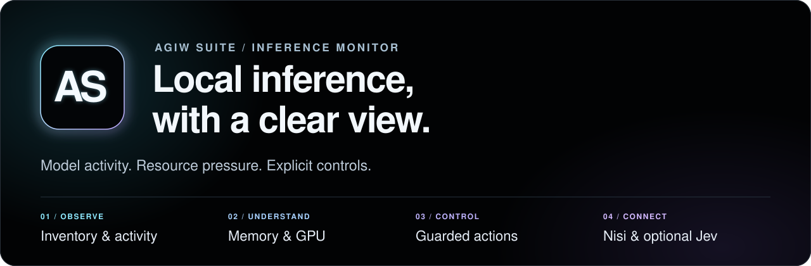

# AGIW Suite · Inference Monitor



_Illustrated overview; this is not a screenshot of the released v1.0.0 (7) app._

A Mac menu-bar monitor for engineers running local models. See model activity, memory pressure and configured worker status, then use explicit controls when a model or service needs attention.

**[Download 1.0.0 for Apple silicon](https://github.com/louiscalata/agiw-suite/releases/download/v1.0.0/AGIW-Inference-Monitor-1.0.0-7-arm64.zip)** · [Release notes](https://github.com/louiscalata/agiw-suite/releases/tag/v1.0.0) · [SHA256SUMS.txt](https://github.com/louiscalata/agiw-suite/releases/download/v1.0.0/SHA256SUMS.txt)

[Release contents](#what-the-download-includes) · [First run](#first-run) · [Source quickstart](#try-the-source-view) · [Troubleshooting](#quick-troubleshooting) · [Activation guide](docs/activation.md)

[Features](#what-you-can-see-and-control) · [OpenCode/MCP](#opencode-and-mcp-scope) · [Implementation & checks](#inspect-the-implementation) · [Local pipeline](#local-only-pipeline) · [Performance & data](docs/performance.md) · [Architecture & API](docs/architecture.md) · [Configuration](docs/advanced-configuration.md) · [Development](docs/development.md) · [Validation limits](#known-validation-limits)

**1.0.0 (7) · Apple silicon · macOS 13+ · Apache-2.0**

This page describes the signed **GitHub Build 7 download**. Repository source and the separate Mac App Store edition can have different features. The download is Developer ID signed and Apple-notarized; [known validation limits](#known-validation-limits) remain open.

## What the download includes

The [v1.0.0 release](https://github.com/louiscalata/agiw-suite/releases/tag/v1.0.0) provides one Apple-silicon app ZIP and its checksum file. GitHub's automatic source archives are not additional app installers. The ZIP contains `Inference Monitor.app`, installation and release notes, `LICENSE`, and `NOTICE`. The app bundles the pinned public **Nisi 0.2.0** workflow engine, journal, CLI and fixed offline self-check. The signed Jev helper is included for optional native Keychain setup and an explicit hosted connection check.

Python, Node.js, model weights, LM Studio, TypeSafe credentials, the private coding router and Windows workers are **not installed by the ZIP**. The Mac App Store edition and any newer source-only work have separate release and verification states.

The signed app was compiled from [this source commit](https://github.com/louiscalata/agiw-suite/tree/caaa7d482a1f168d86c496af4f573dfcbf0490b8). Cloning the default branch below gives a source preview, not the signed Build 7 binary.

## Requirements

| Component | Requirement |
| --- | --- |
| Mac | Apple silicon (arm64), macOS 13 or later |
| Observer | Python 3.9+ at `/opt/homebrew/bin/python3`, `/usr/local/bin/python3` or `/usr/bin/python3` |
| Nisi self-check | External Apple-silicon Node.js 22+ at `/opt/homebrew/bin/node` or `/usr/local/bin/node` |
| Model activity | Separately installed model weights and configured local services such as LM Studio |
| Optional Jev | Your own TypeSafe API key and internet access; provider charges may apply |
| Optional routes/workers | Separately managed router and Windows components |

## First run

1. Download the ZIP and `SHA256SUMS.txt` into the same folder. In that folder, run `shasum -a 256 -c SHA256SUMS.txt`; expect `AGIW-Inference-Monitor-1.0.0-7-arm64.zip: OK`.
2. Confirm Python is available at one of the paths above. Install the external Node runtime if you want the Nisi self-check.
3. Extract the ZIP, quit any running AGIW Monitor edition, and copy `Inference Monitor.app` into Applications.
4. Open the app. Click its menu bar chip icon for the compact monitor, or right-click and choose **Open Dashboard Window**.
5. Review local readings. Cards show unavailable or unknown when services or fresh evidence are absent. Open **Browse → Nisi & optional components** to inspect Nisi or run its fixed offline self-check.

**Next: [activate the suite](docs/activation.md).** The guide walks through connecting LM Studio, verifying Nisi, running the local-only model pipeline, optional Jev setup, existing router/PC connections and login startup—with expected results and troubleshooting.

## Try the source view

On a Mac with Python 3.9 or newer, run this from a directory where you want a new checkout:

```sh
git clone https://github.com/louiscalata/agiw-suite.git
cd agiw-suite
python3 -B server.py --port 8765
```

Open `http://127.0.0.1:8765/` in a browser; press Ctrl-C in the terminal to stop the observer. This runs the local source view on loopback. It does not install or open the signed native app, load a model, or start a coding task. Optional services that are not configured can appear unavailable or unknown. For source tests, Nisi CLI examples and packaging details, use the [development guide](docs/development.md).

## Quick troubleshooting

| What you see | Check first |
| --- | --- |
| No app window or Dock icon | Look for the menu-bar chip; right-click it and choose **Open Dashboard Window**. The GitHub edition is a menu-bar app. |
| Observer reconnecting or Python unavailable | Confirm Python 3.9+ is at a [supported path](#requirements), then quit and reopen the app. |
| Model cards unavailable | Start the LM Studio API server on `127.0.0.1:1234`; models and weights are installed separately. |
| Loaded model, activity unknown | Inspect the reading's source and age and the LM Studio CLI activity feed. Inventory alone cannot prove generation. |
| Nisi self-check cannot run | Install Apple-silicon Node.js 22+ at a [supported path](#requirements); this runtime is separate from the bundle. |
| Jev setup unavailable | Open Components in the installed native app; setup needs your own TypeSafe key. Never post a key in an issue. |
| Router or PC status unavailable | Configure the separate router and Windows worker first; the app ZIP does not install them. Keep private host details out of public issues. |

The [activation guide's troubleshooting table](docs/activation.md#when-activation-does-not-work) covers the full set of states and next steps. A failed or unknown check does not mean a model, external route or provider connection is active.

## What you can see and control

| Capability | What you can do |
| --- | --- |
| **Observe models** | Inspect inventory, activity supported by fresh telemetry, and recorded client/route state. **Browse → Feeds & evidence** explains the observations. |
| **Understand resources** | See Mac memory pressure and best-effort GPU readings. Model-load admission estimates size and headroom before an explicit load. |
| **Choose an inventory view** | **Core 6** filters five pinned LLM IDs plus Nomic Embed Text v1.5. **All discovered** expands the Mac inventory; other reported in-use models stay visible. |
| **Control and recover** | Request guarded model load/unload and supported route/worker recovery. Optional automatic unloading uses fresh resident-pair and route checks; it is off by default. |
| **Inspect public Nisi** | Run the bundled 0.2.0 package’s fixed offline self-check, or explore its workflow engine, journal and CLI. External Node 22+ is required. |
| **Check optional Jev** | Set up your TypeSafe key securely and request a fixed hosted connectivity check. See the [execution and data details](#included-nisi-and-optional-jev-connection). |

Local services and weights are configured separately. Opening AGIW starts no coding task or model; changing a catalog view loads or unloads nothing. Missing or stale observations remain unknown. A loaded model or recorded worker state alone does not prove active generation or a successful route.

[Explore the component reference](docs/architecture.md) for runtime responsibilities, data flow, local HTTP routes and enforced guardrails.

See [advanced configuration](docs/advanced-configuration.md) for resident-model policy, share recovery and memory admission.

## OpenCode and MCP scope

Build 7 can display supported **recorded OpenCode model or session choices** as observation metadata. A recorded choice is not proof that a model is generating now, and it does not grant an agent tool access.

The signed Build 7 download has **no Tool Connections page or MCP connector test/management API**. It does not configure OpenCode MCP servers, change agent permissions, or call MCP tools. Configure external tools in their own client and check that client's permissions separately. Source work added after the signed build does not change what the Build 7 ZIP contains.

## Inspect the implementation

The public repository shows how the monitor turns local observations into a fresh snapshot, then checks evidence again before an explicit model action. Start with the [process and data-flow guide](docs/architecture.md), or follow one layer through its source and focused tests:

| Layer | Implementation | Focused checks |
| --- | --- | --- |
| Model and activity observations | [telemetry.py](telemetry.py), [activity.py](activity.py) | [test_telemetry.py](test_telemetry.py), [test_activity.py](test_activity.py) |
| Snapshot publication and live updates | [server.py](server.py), [live_feed.py](live_feed.py) | [test_server.py](test_server.py), [test_live_feed.py](test_live_feed.py) |
| Guarded load/unload; optional source-server journal | [model_control.py](model_control.py), [durable_model_journal.py](durable_model_journal.py) | [test_model_control.py](test_model_control.py), [test_durable_model_journal.py](test_durable_model_journal.py) |
| Bundled workflow boundary | [Nisi workflow engine](vendor/nisi/package/workflow/engine.mjs), [fixed local-model example](vendor/nisi/package/examples/local-model-workflow.mjs) | [Payload verification](bundle_nisi.py), [bundle checks](test_bundle_nisi.py) |

The fixed Nisi example checks JSON data with four assertions, separate review, one repair attempt and a deadline. Those checks demonstrate a bounded workflow for one task; they are not a general model-accuracy or retrieval evaluation. [Run the example](docs/development.md#local-only-model-example) or [repeat the source checks](docs/development.md#source-checks). The external coding router and worker programs are separate.

## Performance evidence and limits

The reviewed records contain a **139.8 tokens/s server-reported decoding rate** from one Windows worker advisory and a **72.482 tokens/s median effective completion throughput** across 21 Mac requests. The latter divides completion tokens by full request duration. Different workloads and timing denominators prevent a machine-speed comparison. Neither record measures the downloadable app's performance gain.

No matched **No AGIW / AGIW on Mac / AGIW on Mac + PC** experiment has been run, so there is no controlled speedup percentage. The Mac benchmark's **21/21 non-empty responses measure availability, not graded accuracy**. [Review charts, token counts, methods and comparison limits](docs/performance.md), [Ollama and vLLM roles](docs/performance.md#agiw-ollama-and-vllm-roles-and-performance-instrumentation), and the [sanitized aggregate data](docs/data/inference-performance.json). These records do not change the signed release or close native acceptance checks.

## Local-only pipeline

Use Nisi’s public CLI with a model server configured to run both models on this machine:

**Local author → JSON checks → four assertions → local reviewer → run report**

The fixed JSON-configuration example uses a loopback chat endpoint and different configured author/reviewer models. It allows one repair attempt and stops at its deadline. Generated JSON is checked as data; generated programs are never executed.

[Run the local-model example](docs/development.md#local-only-model-example). The GitHub app’s **Nisi self-check** is a separate, model-free example; the CLI does not run arbitrary repository tasks. Optional hosted Jev is separate from this local flow.

## Included Nisi and optional Jev connection

### Nisi · included

The public 0.2.0 workflow engine, journal, CLI, Apache-2.0 license and pinned manifest are bundled and verified offline. Its native fixed self-check uses the external Node runtime, loads no model and installs no weights. Expected report fields:

```json
{"outcome":"COMPLETED","reportStored":true,"modelCalls":0}
```

The public CLI provides fixed demonstrations; library APIs can define broader workflows. The private shared coding router is separately managed and is not bundled. [Public Nisi release](https://github.com/louiscalata/nisi/releases/tag/v0.2.0) · [CLI instructions](docs/development.md#public-nisi-cli)

### Jev · optional

On the Components page, **Set up Jev** opens a secure native dialog for your own TypeSafe API key. The signed helper stores it in the login Keychain. The key stays out of the browser and Python observer; saving it sends no network request.

**Check Jev connection** sends the key in an HTTPS authorization header and one fixed synthetic classification test to TypeSafe. The provider receives your IP address and standard request metadata; usage charges may apply. No files, task prompts or model inventory are sent.

This checks connectivity only. It does not enable coding-task routing or verify provider model identity. External Nisi/Jev router settings are separate. [TypeSafe API documentation](https://docs.typesafe.ai/api)

## Known validation limits

| Evidence | Build 7 status |
| --- | --- |
| **Distribution** | [Exact-source CI](https://github.com/louiscalata/agiw-suite/actions/runs/36758069996), notarization, signature/Gatekeeper checks, ZIP verification and installation parity passed on the maintainer’s Mac. |
| **Component checks** | Native Nisi offline self-check passed with zero model calls. One authorized fixed hosted Jev probe using an existing Keychain credential returned `connected`. |
| **Still open** | Complete native rendering/animation, a quarantined clean-Mac first install, and Jev Cancel/reopen and credential entry/save/remove remain unverified. |

The [roadmap](roadmap.md) records compiled source, package provenance and remaining acceptance work. The successful connection probe does not establish native setup acceptance, live task routing or provider model identity. [rc.2](https://github.com/louiscalata/agiw-suite/releases/tag/v1.0.0-macos-rc.2) and [rc.1](https://github.com/louiscalata/agiw-suite/releases/tag/v1.0.0-macos-rc.1) remain available for rollback.

## Development

Read the [architecture and capability reference](docs/architecture.md) for implementation boundaries. Use the [development guide](docs/development.md) for the local browser view, source checks, Nisi CLI and distribution packaging. The earlier [source-preview release](https://github.com/louiscalata/agiw-suite/releases/tag/v1.0.0-source-preview.1) remains available.

## Support and contributing

For bugs or documentation issues, [open an issue](https://github.com/louiscalata/agiw-suite/issues) with sanitized reproduction steps. For contributions, see [CONTRIBUTING.md](CONTRIBUTING.md).

## Security

The observer binds to IPv4 loopback and checks browser Host/Origin headers, but those checks do not authenticate every local process. Use it on a trusted Mac account and do not expose the observer port to the network. The optional Jev check sends the disclosed synthetic request only after you ask for it; the bundled Nisi self-check makes no model call.

Report vulnerabilities privately using [SECURITY.md](SECURITY.md). Keep credentials, private hostnames and sensitive machine state out of public issues.

## License

[Apache License, Version 2.0](LICENSE), matching public Nisi. Copyright 2026 Louis Calata. See [NOTICE](NOTICE). External model weights and separately managed services are not included.
