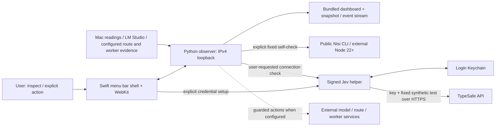

# Architecture and capability reference

AGIW Suite’s public application is the **Inference Monitor**: a native Mac shell around a local Python observer and bundled web dashboard. It also includes public Nisi 0.2.0 and an optional native Jev connection checker. The separately installed coding router and Windows workers supply observations or accept configured recovery actions; their implementation is outside this package.

[Install and first run](../README.md#first-run) · [Advanced configuration](advanced-configuration.md) · [Development](development.md) · [Release evidence](../roadmap.md)

## Runtime and data flow

The diagram describes component responsibility rather than a promise that all optional services are connected. Starting the observer, reading status or opening the app does not run the Nisi demonstration, send the Jev check, start a coding task or load a model. A missing service remains unavailable or unknown.

## Component responsibilities

| Component | Responsibility | Source |
| --- | --- | --- |
| Native shell | Menu bar/window lifecycle, Python observer launch, WebKit navigation and native Jev setup dispatch | [Monitor.swift](../Monitor.swift) |
| Observer and HTTP server | Loopback binding, snapshot/event delivery, bounded action requests and component status | [server.py](../server.py) |
| Telemetry | Collect local readings and inspect configured model, route and worker evidence; preserve freshness/unknown distinctions | [telemetry.py](../telemetry.py), [activity.py](../activity.py) |
| Dashboard | Display evidence and controls; Core 6 / All discovered inventory views | [web/app.js](../web/app.js), [web/map-layout.mjs](../web/map-layout.mjs) |
| Model controls | Explicit load/unload jobs through LM Studio’s `lms` CLI and reported state | [model_control.py](../model_control.py) |
| Automatic unloading | Optional policy with resident-pair and fresh route/admission checks | [auto_unload.py](../auto_unload.py), [server.py](../server.py) |
| Route recovery | Bounded checks and recovery for separately configured external ownership/state | [online_code_repair.py](../online_code_repair.py) |
| Included Nisi | Verify pinned payload and run a fixed offline workflow in temporary storage | [bundled_components.py](../bundled_components.py), [bundle_nisi.py](../bundle_nisi.py) |
| Optional Jev | Python wrapper receives a bounded status receipt; signed native helper owns key and HTTPS exchange | [jev_connection.py](../jev_connection.py), [JevKeychain.swift](../JevKeychain.swift) |
| Packaging | Build, sign and verify application resources and provenance | [build.sh](../build.sh), [package-release.sh](../package-release.sh) |

## Capability boundaries

| Capability | Availability | What the evidence means |
| --- | --- | --- |
| Mac model inventory/resources | Included observer; model service/weights configured separately | Inventory is reported state. Loaded/resident is not proof of generation. Activity needs fresh supporting telemetry. |
| Core 6 catalog view | Included | Five pinned LLM IDs plus Nomic Embed Text v1.5; other reported in-use models remain visible. Filtering changes no model state. |
| Explicit model/recovery controls | Included adapters; external prerequisites apply | Model load/unload uses the local `lms` CLI. Recovery can mutate state, and a configured Windows probe may run a short model request. A source test does not prove a live route. |
| Automatic unloading | Off by default; native Monitor feature | Protects the established resident pair and considers other observed idle models. Freshness, admission and owner checks can block it. |
| Public Nisi offline demonstration | Included public package; external arm64 Node 22+ required | Fixed workflow with a repair cycle and report; expected zero model calls. |
| Public Nisi local-model CLI/library | Included public package APIs | CLI has a fixed JSON demonstration; library users supply task/tool integrations. Monitor’s bundled self-check does not expose arbitrary repository execution. |
| Jev check | Optional, disabled until configured | Explicit fixed synthetic API request verifies connectivity only; it does not enable development-task routing or verify provider model identity. |
| Coding router and Windows workers | Separately managed | Monitor can observe/configure narrow supported recovery paths; those programs and their broader orchestration are not bundled. |
| Nearby-worker KVM | Optional external hardware | Direct setup/recovery access; no verified native AGIW KVM integration, pooled RAM/GPU or throughput gain. |
| Mac App Store edition | Separate application/release | GitHub evidence does not establish its privacy or runtime acceptance. |

## Local HTTP interface

These are the observer’s current routes, not a hosted public service or a promise of a versioned external API. The native app chooses its local port; `python3 -B server.py --port 8765` supplies a fixed port for source exploration. See [development](development.md#try-the-local-view).

| Method | Route | Responsibility |
| --- | --- | --- |
| GET | `/api/snapshot` | Latest snapshot; returns 503 with `status: starting` until the first reading exists |
| GET | `/api/stream` | Live event stream, with bounded stream slots |
| GET | `/api/components` | Bundled Nisi integrity, Node availability and self-check status |
| GET | `/api/components/jev` | Optional connection status; no key returned |
| GET / POST | `/api/models/control` | Read job / request `action` and `modelId` |
| GET / POST | `/api/models/auto-unload` | Read policy / set Boolean `enabled`; unavailable in standalone observer |
| POST | `/api/components/nisi/check` | Exact body `{"action":"self-check"}` |
| POST | `/api/components/jev/check` | Exact body `{"action":"connection-check"}` |
| GET / POST | `/api/online-code-mode/repair` | Read recovery state / request `{"action":"check-and-repair"}` |
| GET / POST | `/api/online-code-mode/entry` | Read entry state / request `{"action":"readiness"}` |
| GET / POST | `/api/online-code-mode/headless` | Read state / request `{"action":"on"}` or `{"action":"off"}` |
| GET / POST | `/api/inference/fix` | Read recovery state / request the supported `scope` |

The implementation in [server.py](../server.py) is authoritative for accepted bodies, errors and availability. Route controls require the supported Mac-owner/configured recovery context. Do not treat an HTTP success or accepted asynchronous request as completion of the underlying operation.

## Guardrails and trust boundaries

- **Local surface:** the server refuses non-IPv4-loopback binding. It validates one exact loopback Host header and matching Origin; action POSTs require Origin. These checks constrain browser requests and do not authenticate every local process.
- **Bounded requests:** action requests require `application/json`, one valid Content-Length between 2 and 1,024 bytes, no Transfer-Encoding, unique JSON keys and endpoint-specific fields. Accepted sockets and live streams are bounded.
- **Resource estimates:** model-load admission uses estimated size plus headroom; it cannot guarantee a model will fit. GPU readings are best-effort accelerator observations. See [model_control.py](../model_control.py) and [gpu_probe.py](../gpu_probe.py).
- **Evidence freshness:** stale or missing telemetry remains unknown; resource/catalog/route observations are not interchangeable proof of active work or successful execution.
- **Model admission:** optional auto-unload is off by default. Fresh resident-pair and router ownership/admission checks protect guarded changes; separately configured router workflows remain external.
- **Nisi integrity:** the included package is pinned and verified before its fixed check. The check uses fixed executable arguments, an isolated temporary directory and an environment excluding Node options, credentials and external router settings.
- **Jev credentials:** native secure entry and login Keychain storage keep credentials out of the browser and Python status. Saving sends no request. The explicitly requested check sends the key and fixed test to TypeSafe; IP/request metadata and possible provider charges are disclosed.
- **Release provenance:** public Build 7 is compiled from `caaa7d4`. Later public source/documentation commits do not change the downloadable binary. Notarization, exact source checks, local installation and complete native acceptance are separate evidence layers.

## Validation and engineering follow-ups

Build 7 has recorded exact-source CI, notarization, signature/Gatekeeper, extraction and installation-parity results. The native offline Nisi check passed without model calls; one fixed hosted Jev check returned `connected`. Full native rendering/animation, quarantined clean-Mac first install and Jev Cancel/reopen/save/remove remain open. The [roadmap](../roadmap.md) retains source hashes, release/regression history and remaining work; [SECURITY.md](../SECURITY.md) describes private reporting.
