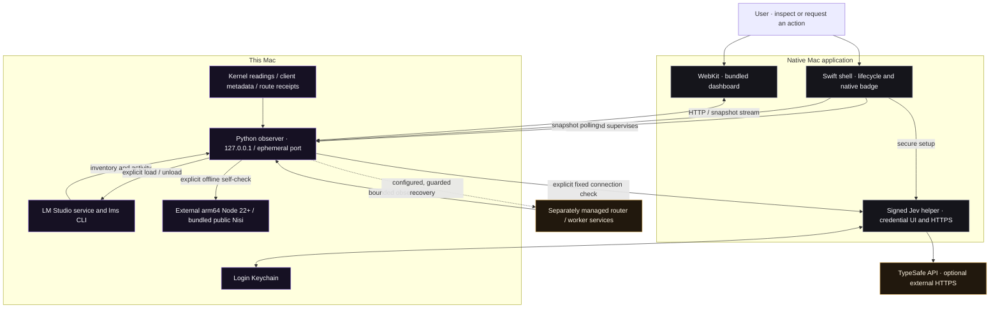
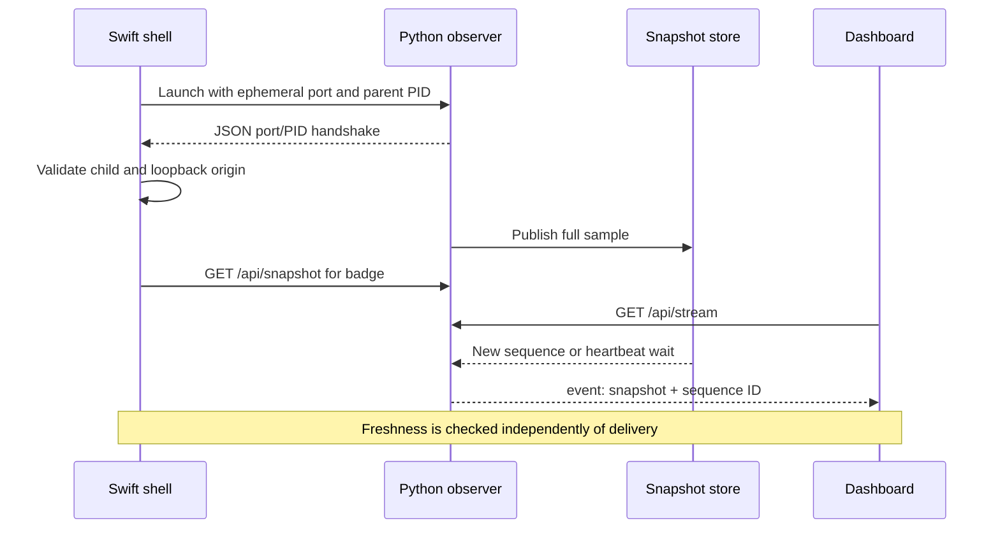
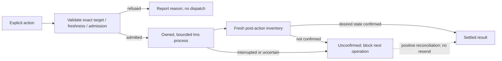
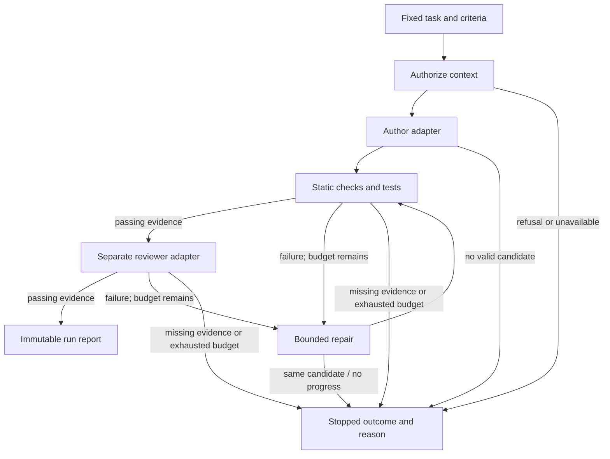

# AGIW Suite architecture

AGIW Suite's public application is **Inference Monitor**: a Swift menu-bar shell, a local Python observer and a bundled web dashboard. It connects resource readings, model inventory and activity evidence in one view, with explicit controls for supported model and recovery operations. Public **Nisi 0.2.0** is included; the hosted **Jev connection check** is optional.

This guide describes the public repository. The downloadable **1.0.0 (7)** application was compiled from `caaa7d4`; later source and documentation commits do not change that binary. The Mac App Store application, external coding router and worker programs have separate implementation and acceptance boundaries.

[Install](../README.md#first-run) · [Activate the suite](activation.md) · [Run from source](development.md#try-the-local-view) · [Configuration](advanced-configuration.md) · [Release evidence](../roadmap.md) · [Security reporting](../SECURITY.md)

**In this guide:** [Processes](#1-system-and-process-boundaries) · [Lifecycle](#2-startup-updates-and-shutdown) · [Evidence](#3-evidence-model-and-map-semantics) · [Resources](#4-model-operations-and-resource-budgeting) · [Nisi](#5-nisi-workflow-engine-and-local-pipeline) · [Jev](#6-jev-credential-and-network-boundary) · [Recovery](#7-recovery-workers-and-parallel-work) · [Storage](#8-state-and-storage-ownership) · [HTTP](#9-local-http-interface) · [Verification](#10-platforms-distribution-and-verification)

## 1. System and process boundaries

The Swift shell and Python observer are separate processes. Action workers may start `lms`, Node or the signed Jev helper. LM Studio, model weights and external router/worker services are separately installed. WebKit loads resources served by the observer; it does not hold the Jev key.

Opening the application starts observation. It does not start a coding task, load models, run a Nisi demonstration or send a Jev request. The memory watchdog can act on explicitly registered work; automatic model unloading requires its separate opt-in policy.

### Component map

| Layer | Responsibility | Implementation |
| --- | --- | --- |
| Native application | Menu bar, compact/dashboard windows, badge, child supervision, WebKit navigation and native setup dispatch | [Monitor.swift](../Monitor.swift) |
| HTTP and snapshot store | Loopback routes, atomic snapshot publication, event stream, action dispatch and shutdown | [server.py](../server.py) |
| System and model observations | LM Studio inventory/activity, Mac resources, router and worker observations | [telemetry.py](../telemetry.py), [gpu_probe.py](../gpu_probe.py) |
| Evidence readers | Change-driven overlays, sanitized run receipts, recorded client choices and local caller observations | [live_feed.py](../live_feed.py), [activity.py](../activity.py), [client_models.py](../client_models.py), [local_callers.py](../local_callers.py), [nisi_v02.py](../nisi_v02.py) |
| Presentation | Map geometry, evidence inspector, activity display and explicit action controls | [web/app.js](../web/app.js), [web/map-layout.mjs](../web/map-layout.mjs), [web/model-control-view.mjs](../web/model-control-view.mjs), [web/components.js](../web/components.js) |
| Resource management | Memory admission, registered-process pause/resume and optional idle-model unloading | [mem_guard.py](../mem_guard.py), [auto_unload.py](../auto_unload.py) |
| Model operations | Exact model/instance selection, bounded CLI jobs and observed settlement | [model_control.py](../model_control.py), [durable_model_journal.py](../durable_model_journal.py) |
| Recovery adapters | Bounded local-runtime, router, share and worker recovery; fixed worker probe | [online_code_repair.py](../online_code_repair.py), [windows_probe.py](../windows_probe.py) |
| Included Nisi | Pinned public payload, integrity checks and fixed offline demonstration | [bundled_components.py](../bundled_components.py), [bundle_nisi.py](../bundle_nisi.py), [vendored package](../vendor/nisi/package/README.md) |
| Optional hosted Jev | Bounded status wrapper; native helper owns credential storage and the fixed exchange | [jev_connection.py](../jev_connection.py), [JevKeychain.swift](../JevKeychain.swift) |
| Distribution | Compile, resource allowlists, signing, provenance, packaging and login launcher | [build.sh](../build.sh), [package-release.sh](../package-release.sh), [login-agent.sh](../login-agent.sh) |

## 2. Startup, updates and shutdown

The shell takes its kernel-held edition instance lock before creating the status item or observer. Cross-edition coordination considers eligible full/MAS main executables, excludes helpers and uses deterministic PID ordering. Inventory rechecks reconcile overlap; this is not an atomic mutex across editions.

The shell selects an executable Python interpreter from `/opt/homebrew/bin/python3`, `/usr/local/bin/python3` or `/usr/bin/python3`. It launches bundled `server.py` with `--port 0` and its parent PID. The observer prints a JSON port/PID handshake; the shell validates it before accepting the exact loopback origin.

- **Sampling:** nominal full readings every second; a 0.15-second tick rereads evidence groups whose file fingerprints changed. Fast overlays apply only to a full sample at most three seconds old. These are implementation intervals, not guaranteed latency.
- **Publication:** `SnapshotStore` replaces a deep-copied snapshot under a lock and wakes stream readers. It retains up to 90 full-sample history points and 50 observed transitions. An overlay does not create another history point.
- **Clients:** the native badge polls once per second; the web dashboard receives Server-Sent Events and falls back to polling when streaming is unavailable. Each stream includes `event: snapshot`, a sequence ID and JSON data, with heartbeat comments between updates. The stream supplies the newest observation, not a durable replay of every event.
- **Failure:** no first reading produces HTTP 503 with `status: starting`. Failed collection preserves the old timestamp so clients can age it out. The shell has a ten-second startup timeout, reconnects with backoff capped at 30 seconds and resets backoff after stable operation. Repeated poll failures trigger observer recovery.
- **Shutdown:** the shell targets its own child. The observer watches parent identity, ends streams, cancels owned workers and closes the memory guard, resuming work it paused. Cancellation of a CLI or network client does not prove that an external service rolled back accepted work.

Source: [shell lifecycle](../Monitor.swift), [sampling and store](../server.py), [overlay reader](../live_feed.py).

## 3. Evidence model and map semantics

The snapshot uses `schemaVersion: 1`, `sampledAt`, `observedAt`, model rows and per-source status. Its component projections include `pipeline`, `onlineCodeMode`, `windowsWorker`, `windowsJobs`, `canary`, `nisiV02` and `afm`; the server adds resources, client/caller observations, activity, controls, history and sequence information. Readers validate the fields they use rather than treating a file's existence as proof.

| Signal | Supports | Does not establish |
| --- | --- | --- |
| LM Studio API inventory | Catalog and loaded-instance membership | Active token generation |
| Fresh `lms ps` activity | Reported idle, busy/generating phase and queue state | Percentage completion of a task |
| Client session metadata | Recorded/configured Codex, Claude or OpenCode model identity | That client is currently working; Cursor's unsupported metadata schema is not guessed |
| Router records plus ownership checks | Validated run/checkpoint identity and observed running/queued state | Successful completion from a stale pointer |
| Sanitized completion receipts | Bounded stage/result evidence tied to the recorded run | Arbitrary model claims or every underlying call ledger |
| Worker heartbeat/job evidence | Advertised worker capabilities, freshness and retained job state | Native Windows acceptance or a new inference result |
| AFM executable observation | Installation/executable permission state | A successful Apple Foundation Models request |
| External Nisi activation receipt | Verified runtime/host pins and recorded activation probe | Current activity or acceptance of the bundled public Nisi example |

Map branches represent these relationships and observations. Fresh, verified busy/generating local activity can pulse; idle, stale and unknown states do not imply active work. Pulse phase represents observed activity, not task progress percentage. GPU readings are best-effort accelerator observations, not a cross-machine resource pool.

Dashboard **Pause / Resume** controls the displayed snapshot only. Observation, inference and the registered-work memory watchdog continue; this view control is separate from the guard's process pause/resume actions.

**Core 6** is a catalog filter: five pinned language-model IDs plus Nomic Embed Text v1.5. **All discovered** expands inventory, and other reported in-use models remain visible. Neither view loads models or reserves RAM for six residents. See [resident budgeting](advanced-configuration.md#resident-model-budget).

## 4. Model operations and resource budgeting

### Explicit load/unload lifecycle

`ModelControl` retains one operation at a time. It validates a selected Mac row no older than three seconds, checks exact model keys for loads and exact loaded-instance IDs for unloads, then rechecks before dispatch. Unload requires confirmed idle activity and zero queued work. The installed CLI must pass ownership, permissions and file-type checks.

Load admission estimates `model size × 1.15 + 1 GiB`, or 8 GiB if size is unavailable, and asks the memory guard. This is a resource estimate, not a guarantee that a model fits. CLI execution is bounded: 120 seconds for load, 30 for unload, 64 KiB output and a separate confirmation interval. An accepted HTTP request and a successful CLI exit are distinct from observed settlement.

Interrupted dispatches retain an **unconfirmed** latch. Cancellation is not rollback; fresh positive desired-state evidence is required to clear uncertainty. Internal cancellation/reconciliation methods are not extra public HTTP endpoints.

The optional `--durable-model-control` source-server flag adds a private write-ahead journal across observer restarts. Missing or corrupt journal state blocks actions and is not silently repaired. The native shell's launch command **does not enable this flag**; its default operation latch is process-local.

### Two resource policies

| Policy | Scope and default | Action and protections |
| --- | --- | --- |
| Memory guard | Kernel/resource samples, admission and explicitly registered jobs | Can pause registered work with SIGSTOP and resume it with SIGCONT. It records paused identities for recovery, never kills processes and never unloads models. Missing evidence can refuse heavy admission. |
| Automatic unloading | Native Monitor context; **off by default** | Uses the existing model-control path for other observed idle instances. Protects the established resident Nisi author/reviewer pair and configured additions. Fresh activity, ownership/admission, cooldown and journal checks can refuse every unload. |

Auto-unload normally waits 20 observed idle minutes. For LLMs, sustained tight/critical memory can use the configured shorter threshold; embedding instances retain the normal threshold. A newly seen model starts a new idle clock. A machine-level owner lock, hourly limit and durable attempt/outcome records bound the policy. It never loads a model.

The separately configured Nisi router chooses distinct already-resident LLMs for author and reviewer instead of loading another model for orchestration. That router's choice is external to the Monitor's model-free bundled self-check. [Configuration and memory details](advanced-configuration.md).

## 5. Nisi workflow engine and local pipeline

There are three distinct integrations:

| Integration | Execution contract |
| --- | --- |
| **Included native self-check** | Verify the public payload, select an external native arm64 Node 22+ runtime, run fixed `demo` arguments in temporary storage, validate `COMPLETED`, `reportStored: true`, `modelCalls: 0`. No model is loaded or called. |
| **Public CLI local-model example** | Fixed JSON configuration task using two distinct configured model IDs and a loopback chat endpoint. Static JSON checks, four assertions and separate review; one repair attempt and a deadline. Generated programs are not executed and repository edits are not applied. |
| **External coding router** | Separately installed host integrations and policy. The Monitor reads bounded evidence and offers supported recovery adapters; the broader router implementation is not shipped here. |

The [workflow engine](../vendor/nisi/package/workflow/engine.mjs) validates task, candidate and adapter evidence, binds stages to fingerprints, limits repair and handles cancellation/deadlines at any stage. Repeated candidate fingerprints can stop with `NO_PROGRESS`. `COMPLETED` means required stages returned valid passing evidence; callback honesty, actual tool execution, applying files and release decisions remain host responsibilities. These controls limit loops and unsupported completion claims; they do not guarantee hallucination-free output.

The [run journal](../vendor/nisi/package/history/run-journal-v1.mjs) records observations with redaction, a hash chain, TTL and heartbeat-based liveness. Damaged reopen seals the journal. The [store](../vendor/nisi/package/history/run-journal-store-v1.mjs) validates, writes through a temporary file, syncs, reads back and renames; committed and durable are separate results. Hosts must serialize writers. Journal views are `authorizing: false` and do not grant execution authority.

Public Nisi also includes an [Apple Foundation Models adapter](../vendor/nisi/package/adapters/apple-foundation-models.mjs) and content/file-policy modules. A compatible native helper, permission policy and actual host invocation are prerequisites; including those modules or detecting `afm` does not activate an AFM pipeline automatically.

The native self-check excludes Node options, credentials and external router settings from its temporary environment. Its report is checked before the Components page calls the demonstration passed. Use the [development guide](development.md#local-only-model-example) for the model-backed example; loopback addressing alone does not establish local execution if the configured server proxies requests elsewhere.

## 6. Jev credential and network boundary

**Setup:** Components → Set up Jev → origin-checked WebKit message → Swift shell → signed helper's secure native dialog → login Keychain. Python and the browser receive no key. Saving a credential sends no hosted request.

**Connection check:** explicit dashboard action → same-origin POST → Python worker → helper `check` → fixed HTTPS request to `https://api.typesafe.ai/v1/systemone` → bounded validated status receipt. The key is sent in the authorization header with a fixed synthetic classification test. No project files, task prompts or model inventory are sent by this check. The provider receives IP/request metadata and usage charges may apply.

The helper refuses redirects, bounds response size/time and returns an allowlisted status such as `connected`, `auth-failed`, `rate-limited` or `invalid-response`. Python suppresses raw helper/provider output and coalesces concurrent check requests. A `connected` result verifies this fixed exchange; it does not verify provider model identity or enable coding-task routing. A source checkout intentionally lacks the installed signed helper.

The GitHub edition's explicit check and the separate MAS edition's consent flow must be evaluated in their own applications. Credential lifecycle, privacy declarations and App Review access require separate acceptance evidence. [TypeSafe API documentation](https://docs.typesafe.ai/api) · [native helper](../JevKeychain.swift) · [status wrapper](../jev_connection.py).

## 7. Recovery, workers and parallel work

The dashboard's top-bar **Fix inference** button immediately requests scope `all`: local runtime, Nisi and route checks. The inspector's **Fix Nisi Inference** shortcut opens that panel without dispatch; **Run check** submits the same combined action. Closing the panel does not cancel a running repair. Legacy scoped API callers remain supported. The adapter records bounded steps and can report `ready`, `needs-action` or `error`; an action's name does not guarantee recovery.

- **Local runtime:** start a stopped LM Studio server only after owner status and the fixed loopback port are checked and rechecked. A running-but-unreachable server is not replaced, and loaded models are preserved. Fresh inventory and activity are required to report readiness.
- **Route/share:** use trusted owner commands and explicitly configured SMB host/account settings. Guest/Anonymous and ambiguous mounts are refused. Running or unresolved work blocks disruptive recovery. An exact retained Windows job can be reconciled; a timeout is not permission to resend it.
- **Nisi:** check route/Nisi ownership, marker identity/age, idle model state, resident pair and optional external Jev configuration. Recovery acknowledgement must match fresh retained evidence. The bundled public demo and the private router recovery marker are separate state.
- **Windows:** a configured recovery path can make one short fixed inference probe. Heartbeat/capability reads alone make no inference request. The returned job, response and timing establish only that probe.

The separate **PC LLM** switch delegates to the supported external headless owner. Enabling it requests a four-hour hold and one guarded probe; disabling it releases that mode. Fresh supported worker/headless evidence is needed to expose usable switch state. This is separate from a recovery probe and development-task submission.

Parallel router work is observed through validated legacy/per-run records and ownership/admission evidence. One Monitor model operation is retained at a time; HTTP worker concurrency is not a model scheduler. The broader router owns task assignment, host concurrency and resource budgeting. AGIW does not combine Mac/PC RAM or GPUs, and observations alone do not establish speed improvements.

An optional Openterface Mini-KVM provides direct console access to nearby workers for setup/recovery. Network inference still uses configured endpoints and transport; native AGIW KVM integration is unverified. [Hardware and share settings](advanced-configuration.md).

## 8. State and storage ownership

| State | Owner / purpose |
| --- | --- |
| `~/.local/state/inference-monitor/endpoint.json` | Best-effort observer discovery: port, PID and start time. Not authentication or proof of health. |
| Snapshot, history and event sequence | Observer memory; replaced on restart. SSE is not a persistent task journal. |
| `~/.local/state/inference-monitor/` operation/policy records | Monitor recovery receipts, optional model journal and auto-unload attempts/owner lock. Durable model journaling needs explicit activation. |
| `~/.config/agiw/auto-unload.json` | Opt-in policy, protected additions, idle thresholds and hourly limit. |
| `~/.config/agiw/mem-guard.json`; `~/.local/state/agiw/mem-guard/` | Memory policy, fresh kernel sample and identity-bound registered/paused jobs. The short-lived sample is owner-only and must not be renewed from stale fallback data. |
| External router/client/worker state | Read with bounded, validated projections. These programs own their records and job authority; the Monitor does not rewrite arbitrary evidence. |
| Temporary Nisi workspace | Isolated model-free check/report; removed after the check. Native check status remains in the observer process. |
| Login Keychain Jev item | Signed native helper owns credential entry/read/remove. No credential in browser storage or HTTP status. |
| Per-user LaunchAgent | Optional login startup managed by the included launcher; separate from the app instance and router locks. |

Safe readers reject relevant unsafe ownership, permissions, file types and changed records. These checks protect specific contracts, not every file in a user's home directory. See the owning modules before changing formats or migration behavior.

## 9. Local HTTP interface

The native app chooses its port. For source exploration, `python3 -B server.py --port 8765` serves `http://127.0.0.1:8765/`. Routes are internal observer interfaces; they are not a hosted service or a versioned third-party API. The implementation in [server.py](../server.py) is authoritative.

| Method | Route | Body / result |
| --- | --- | --- |
| GET | `/api/snapshot` | Latest snapshot; 503 `status: starting` before the first sample |
| GET | `/api/stream` | SSE snapshots, sequence IDs and heartbeat comments |
| GET | `/api/components` | Public Nisi integrity, Node availability and self-check status |
| GET | `/api/components/jev` | Configuration/check status; no key |
| GET / POST | `/api/tool-connectors` | Sanitized global OpenCode file discovery and AGIW-saved loopback MCP endpoints; explicit `add`, `test`, `disconnect` actions. Bundled in new builds from this branch, not in the published Build 7 download. |
| GET / POST | `/api/models/control` | Read retained operation / exact `action` (`load` or `unload`) and `modelId` fields |
| GET / POST | `/api/models/auto-unload` | Read policy / exact Boolean `enabled`; unavailable in standalone observer |
| POST | `/api/components/nisi/check` | `{"action":"self-check"}` |
| POST | `/api/components/jev/check` | `{"action":"connection-check"}` |
| GET / POST | `/api/online-code-mode/repair` | Read recovery / `{"action":"check-and-repair"}` |
| GET / POST | `/api/online-code-mode/entry` | Read entry state / `{"action":"readiness"}` |
| GET / POST | `/api/online-code-mode/headless` | Read state / `{"action":"on"}` or `{"action":"off"}` |
| GET / POST | `/api/inference/fix` | Read recovery / `{"scope":"all"}`; legacy `local`, `route`, `both`, `nisi` also accepted |

Action jobs generally return **202 Accepted**, followed by status reads. The auto-unload setting returns 200 after saving. Invalid requests, stale evidence, unavailable components and conflicts return distinct errors; acceptance is not execution completion. Route controls need the supported Mac-owner/configured recovery context.

The Tool Connections API is separate from Nisi and model controls. Its `ready` status records a bounded MCP initialization and tool-list check for the listed 2025 Streamable HTTP versions, and expires after 60 seconds; it does not establish agent permission, tool execution or an active model route. Newer-only MCP servers are outside this probe's current scope. `disconnect` deletes AGIW's saved address, not the external server. Saved endpoint paths are returned by GET and must not contain secrets. Its local-process trust boundary is the same as the other observer routes below.

### Request and navigation protections

- Bind only to IPv4 loopback. Require one exact loopback Host header and matching Origin; action POSTs require Origin. This limits browser-origin requests and does not authenticate every local process.
- Require `application/json`, one valid Content-Length of 2–1,024 bytes, no Transfer-Encoding, unique JSON keys and endpoint-specific fields. Reject arbitrary commands, executable arguments and extra fields.
- Bound the server to eight connections and three live streams. Ordinary connections have deadlines; streams have separate write limits. These are backpressure limits, not task-worker capacity.
- Restrict WebKit navigation and bridge messages to the selected origin; designated documentation links open externally. Render observed/helper text as data, not authority or executable code.

## 10. Platforms, distribution and verification

| Surface | Current scope |
| --- | --- |
| GitHub downloadable app | Developer ID signed/notarized Build 7; Apple silicon, macOS 13+, external Python and arm64 Node for the native Nisi self-check |
| Public source | Observer, native shell/helper, dashboard, adapters, tests, packaging and pinned Apache-2.0 public Nisi; no model weights or private router runtime |
| Mac App Store | Separate sandboxed application, runtime packaging, consent, privacy, screenshots and exact-build acceptance; GitHub checks do not close its release gates |
| Intel Mac / Windows / Linux | Port development has separate source/native acceptance requirements. The current v1.0.0 asset does not distribute these platforms; Mac-side worker observations are not a Windows application build |

The release packager freezes its source/resource inputs, checks hashes and compiled identity, verifies legal/Nisi resources and validates staged/extracted artifacts. Developer ID signing, notarization, Gatekeeper, installation parity and native workflow acceptance are separate layers. Later documentation changes require no binary rebuild.

### Where to verify a change

| Changed layer | Relevant checks / evidence |
| --- | --- |
| Snapshot/readers | Telemetry, live-feed, activity, client-model and HTTP fixtures |
| Controls/recovery | Model-control, durable-journal, auto-unload, memory-guard and online-repair suites; actual service evidence for live acceptance |
| Native shell/helper | Extracted Swift policy/helper harnesses, full Swift typechecks, signed-app UI and credential lifecycle checks |
| Dashboard | Node tests for map/evidence/action behavior; native WebKit rendering and motion remain separate |
| Nisi payload | `bundle_nisi.py --verify`, component fixtures and actual fixed demonstration result; a model-backed run needs its own receipt |
| Distribution | Frozen-input/resource manifest, architecture/signature/ticket checks, extraction parity and clean supported-Mac first installation |

See [development](development.md#source-checks) and [CI configuration](../.github/workflows/source-checks.yml) for actual commands. Isolated CI explicitly skips 45 tests requiring state writers from the separate router project. Fixtures and typechecks do not establish live provider/worker behavior.

Build 7 has recorded exact-source CI, notarization, signature/Gatekeeper, extraction and installation-parity results. Its native offline Nisi check passed with zero model calls; one authorized fixed hosted Jev check returned `connected`. Complete native rendering/animation, quarantined clean-Mac first installation and Jev Cancel/reopen/save/remove remain open. The [canonical roadmap](../roadmap.md) records those limits and release hashes.
