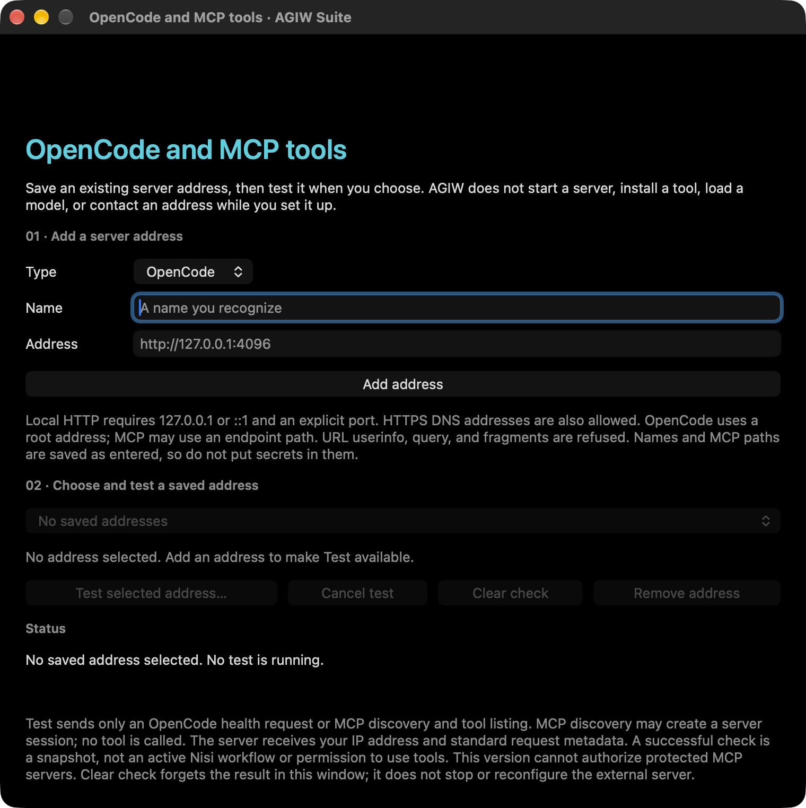

# Native Connections candidate preview

This image shows the **separate, unreleased Mac App Store Build 16 candidate** in an ad hoc local launch. It is an empty setup form: no address was saved or tested, and it does not show a live connection. It is not the GitHub v1.0.0 (7) download or a UI included in this repository's Tool Connections API draft.

The native candidate's form mentions HTTPS DNS addresses and IPv6 loopback. The **public API draft** in this repository currently accepts only literal `http://127.0.0.1:<port>/<path>` addresses and has no matching native view. Its [source behavior and validation limits](development.md#unreleased-tool-connections-api) should govern any GitHub-edition implementation. A future screenshot of the GitHub app must come from a tested build of that edition.
