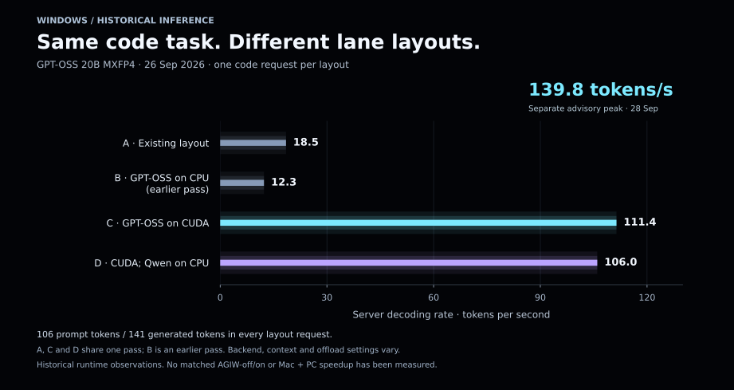
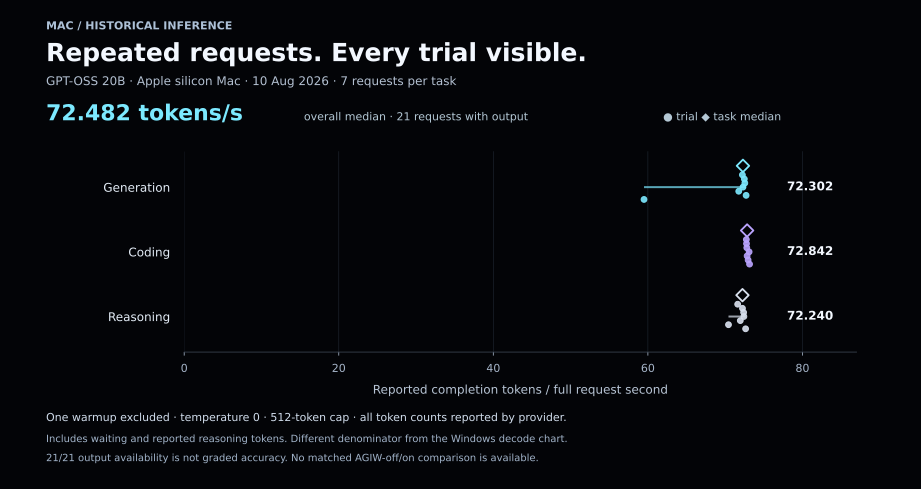

# Inference performance: charts, data and measurement boundaries

[Activate the suite](activation.md) · [Architecture](architecture.md) · [Release evidence](../roadmap.md) · [Aggregate JSON](data/inference-performance.json)

These are **historical observations of separately configured inference runtimes**, reviewed on 1 October 2026. They supply concrete workload and timing data. They are not a controlled test of installing AGIW Suite, and they do not establish a speedup for the GitHub or Mac App Store application.

## Highest reviewed decoding record

| Field | Recorded value |
| --- | --- |
| Platform and lane | Windows worker, fast lane |
| Model returned by the server | `openai/gpt-oss-20b` |
| Workload | Bounded failure-mode advisory |
| Date | 28 September 2026 |
| Server decoding rate | **139.7561149917549 tokens/s**, displayed as **139.8 tokens/s** |
| Prompt / generated completion tokens | 201 / 265 |
| Recorded decode duration | Not available in this receipt |
| Recorded job elapsed time | 6.7 seconds |
| Approximate output / recorded job second | **39.6 tokens/s** (`265 / 6.7`), using the rounded recorded elapsed time |
| Evidence | One retained successful worker job receipt |
| Exact GPU binding | Not established by that receipt |

The 139.8 rate is the server's `timings.predicted_per_second`. Its denominator covers decoding, rather than the entire job. The separate **39.6** value divides completion tokens by the broader, rounded recorded elapsed time; it is an approximate output rate, not server decoding speed or validated tasks per second. This is the highest decoding value found in the reviewed retained records, not a sustained-throughput guarantee or a comprehensive benchmark of every installed model. A successful advisory response also does not prove that its suggestions are correct or that an engineering task passed acceptance.

## Windows: same code task, different lane layouts



| Layout | GPT-OSS placement and companion configuration | Decode tokens/s | Recorded decode time | Request wall time | Prompt / generated tokens | Observations |
| --- | --- | ---: | ---: | ---: | ---: | ---: |
| A | Existing Vulkan configuration; Qwen on CUDA | 18.5 | 7631.21 ms | 8.80 s | 106 / 141 | 1 |
| B | GPT-OSS on CPU; Qwen across two Vulkan devices | 12.3 | 11483.33 ms | 12.71 s | 106 / 141 | 1 |
| C | GPT-OSS on CUDA; Qwen on Vulkan | 111.4 | 1257.03 ms | 1.46 s | 106 / 141 | 1 |
| D | GPT-OSS on CUDA; Qwen on CPU | 106.0 | 1320.25 ms | 1.53 s | 106 / 141 | 1 |

### Method and limits

The dedicated 26 September benchmark used the same **GPT-OSS 20B MXFP4 weights** and a fixed JavaScript code-generation task, temperature 0, low reasoning effort and a 400-token cap. A short warmup request preceded each lane's measurements and is excluded here. The measurement script read `timings.predicted_per_second` from the llama-server response, rounded it to one decimal place, and separately timed the full HTTP request. Decode durations above come from the matching raw server timing logs; they were not back-calculated from rounded rates. Server timing/count conventions can differ from a naive token-count/rate division.

All four retained code requests reported 106 prompt tokens and 141 completion tokens. A, C and D are from the pass starting at **16:54:40 UTC**; B is from an earlier pass starting at **16:38:04 UTC**, both on 26 September. Backend, context capacity and offload settings vary between layouts. There is only **one retained code observation per layout**, so there is no repeated-trial uncertainty estimate. The chart illustrates configuration sensitivity on that Windows worker; it does not isolate a single setting's causal effect, measure Mac + PC aggregate throughput, or show an AGIW-off/on comparison. Concurrent requests elsewhere in the same benchmark were two lanes on the **same PC**, not a Mac + PC experiment.

## Mac: repeated requests with a full-request denominator



| Task | Requests with output | Generated completion tokens/request | Median effective tokens/s | Minimum | Maximum |
| --- | ---: | --- | ---: | ---: | ---: |
| Generation | 7 | 173 once; 166 in six requests | 72.302 | 59.500 | 72.711 |
| Coding | 7 | 180 in each request | 72.842 | 72.743 | 73.156 |
| Reasoning | 7 | 171 in each request | 72.240 | 70.431 | 72.646 |
| All tasks combined | 21 | Counts include reported reasoning tokens | **72.482** | 59.500 | 73.156 |

### Method and limits

The retained 10 August 2026 streaming benchmark identified the host as an Apple-silicon **MacBook Pro M5 Pro with a 20-core GPU**, and requested `openai/gpt-oss-20b`. These hardware/model labels are recorded benchmark metadata. Seven requests for each of three fixed tasks followed one excluded warmup, at temperature 0 and a 512-token cap. All 21 requests completed with provider-reported completion token counts; the character-count fallback was not used in these results.

The script computes:

```text
effective completion throughput = reported completion tokens / full request duration
```

Full request duration includes waiting before output arrives. Reported completion counts can include hidden reasoning tokens. Median time to first **visible text** was 1.0959 seconds; population standard deviation of the 21 effective rates was 2.811 tokens/s. The chart shows every retained trial and its task median. These are descriptive statistics from one benchmark run, not a confidence interval or a sustained-load test.

This metric has a different denominator from the Windows **decoding-only** metric, and the workloads, dates and runtime conditions also differ. Dividing the Windows peak by the Mac median would produce a misleading machine-speed percentage. Neither record states that AGIW was toggled under otherwise identical conditions. The Mac dataset retains full-request times, not a separately instrumented decoding-phase duration.

## Accuracy and overall performance

| Requested metric | Available evidence | Measurement status |
| --- | --- | --- |
| Generated tokens and speed | Counts and explicitly scoped rates in the historical records above | Recorded |
| Decode duration | Matching Windows fixed-code raw timing logs; absent from the peak receipt and Mac request data | Partly recorded |
| Response availability | Mac benchmark returned non-empty output in 21 of 21 requests | **100% response availability**, not accuracy |
| Correctness / task accuracy | These records do not apply a deterministic oracle or a reviewed grading rubric to every output | **Ungraded** |
| Validated engineering tasks/minute with AGIW | No matched acceptance experiment across the three requested conditions | **NOT_RUN** |
| Overall AGIW performance score | No defined, validated composite score or controlled baseline | Unmeasured |

A successful HTTP response, fast decoding, or non-empty output supplies no correctness percentage by itself. A useful overall comparison needs both timing and a task-specific acceptance oracle, with failed tasks and repair attempts included. The fixed public Nisi example's assertions are narrow workflow checks; passing them would not establish general model accuracy on engineering tasks.

## Before and after: No AGIW → Mac → Mac + PC

| Condition | Controlled definition | Matched throughput | Validated task rate | Status |
| --- | --- | --- | --- | --- |
| **No AGIW Suite** | Same Mac, model, runtime, prompts and token budget, with the AGIW monitor stopped | Unmeasured | Unmeasured | **NOT_RUN** |
| **AGIW Suite on Mac** | Same Mac workload with the AGIW monitor running | Unmeasured | Unmeasured | **NOT_RUN** |
| **AGIW Suite on Mac + PC** | Same total validated workload split across configured Mac and PC workers; report each host separately | Unmeasured | Unmeasured | **NOT_RUN** |

**0 of 3 matched conditions have a retained controlled result.** Missing measurements are `null` in the downloadable data, never zero. There is no measured percentage uplift to plot yet. The independent historical charts above retain their own metric definitions and do not fill these missing conditions.

The public monitor observes runtimes and offers explicit guarded controls. It starts no coding task merely by opening. External routing and Windows worker setup are separately managed. Two hosts can process independent work concurrently when those components are configured, but their generation rates cannot simply be added to predict the completion time of a sequential author/reviewer workflow. Its validated task rate also depends on output quality, retries and dependencies.

### Protocol for a fair comparison

1. Freeze the runtime version, model weights and quantization, prompt set, output cap, sampling settings and task validator. Record hardware, resource pressure and which models are resident. Use the same Mac model in both single-host conditions.
2. Separate cold-start measurements from warm requests. Keep the warmup policy fixed and repeat each condition; alternate their order to reduce time/load bias. Record failures and retries alongside successes.
3. Measure **full-request tokens/s**, time to first visible text and end-to-end task wall time with the same clocks and token-count definitions. Keep server decoding speed as a separate field.
4. For Mac + PC, run the same total work set using explicitly configured workers. Record per-host throughput, scheduling/transport overhead and total makespan. Count **validated tasks per minute**, rather than summing unrelated single-request peaks.
5. Report sample counts, medians, ranges and the actual task-pass criteria. Calculate speedup only from comparable matched results: `(after / baseline - 1) × 100%` for throughput, or `(baseline time - after time) / baseline time × 100%` for time saved.

No new inference request, model loading, worker reconfiguration or benchmark was performed to produce this documentation.

## AGIW, Ollama and vLLM: roles and performance instrumentation

This is a capability comparison with two established open-source inference projects, based on primary documentation checked on **1 October 2026**. It is not a speed or accuracy ranking; no matched three-project benchmark has been run here.

| Dimension | AGIW Suite, shipped GitHub edition | Ollama | vLLM |
| --- | --- | --- | --- |
| Main role | Mac inference monitor with explicit guarded controls and public Nisi examples | Runs and manages models through a local API. [Project](https://github.com/ollama/ollama) | Inference and serving engine. [Project](https://github.com/vllm-project/vllm) |
| Platform scope | Current download: Apple silicon, macOS 13+; App Store edition separate | macOS, Windows and Linux installation paths. [Project](https://github.com/ollama/ollama) | Multiple GPU/CPU backends; Apple-silicon support via a hardware plugin. Features depend on the backend. [Installation](https://docs.vllm.ai/en/latest/getting_started/installation/) |
| Parallel execution | Observes configured workers; external coding router/PC worker setup is separately managed | Parallel requests and multiple resident models when memory permits. [Concurrency](https://docs.ollama.com/faq#how-does-ollama-handle-concurrent-requests) | Continuous batching and distributed parallelism. [Project](https://github.com/vllm-project/vllm) |
| Resource behavior | Fresh memory readings, load admission and guarded optional unloading | Resident-model, queue, parallel-request and keep-alive settings. [FAQ](https://docs.ollama.com/faq) | PagedAttention and prefix caching. [Project](https://github.com/vllm-project/vllm) |
| Generation instrumentation | Displays supported observed evidence; this page publishes scoped retained records | Output count, generation duration, prompt timing and total duration. [Generate API](https://docs.ollama.com/api/generate) | Generated-token counters, TTFT, request latency, decode and queue metrics. [Metrics](https://docs.vllm.ai/en/latest/usage/metrics/) |
| Built-in workflow in this release | Fixed public Nisi demonstrations; optional fixed hosted Jev check | Model execution API; task validators belong to the consuming application | Model serving API; task validators belong to the consuming application |
| Accuracy claim | No general graded accuracy result for the shipped app | No matched accuracy measurement in this comparison | No matched accuracy measurement in this comparison |
| License | Apache-2.0 | MIT. [Project](https://github.com/ollama/ollama) | Apache-2.0. [Project](https://github.com/vllm-project/vllm) |

AGIW currently observes LM Studio and configured external evidence; this comparison does not establish native Ollama or vLLM integration, cross-runtime parity, or throughput gains. A fair runtime comparison would freeze the same hardware, weights, precision, workload, batching and output checks, then measure end-to-end validated work with consistent metric definitions.

### Choosing by use case

- **AGIW Suite:** use the shipped Mac dashboard to inspect supported runtime activity and memory, and perform explicit guarded controls. Its fixed Nisi examples and optional Jev connection check have a narrower scope than a general production task orchestrator; native acceptance limits remain disclosed in the release.
- **Ollama:** consider it when the main need is running and managing models across Mac, Windows and Linux through a local API, with documented resident-model and concurrency settings. [Project](https://github.com/ollama/ollama), [FAQ](https://docs.ollama.com/faq).
- **vLLM:** consider it when the main need is serving concurrent requests or distributing model execution, with continuous batching and detailed server metrics. Check support for the intended model and hardware backend before choosing it. [Project](https://github.com/vllm-project/vllm), [Installation](https://docs.vllm.ai/en/latest/getting_started/installation/), [Metrics](https://docs.vllm.ai/en/latest/usage/metrics/).

AGIW's practical opportunity is to make supported runtime state and controls understandable in one desktop view. Adding Ollama or vLLM as a backend would require a separately implemented and verified adapter; the current release supplies no such integration.

## Data provenance and reuse

[inference-performance.json](data/inference-performance.json) contains sanitized numeric observations, metric definitions, task distributions and explicit missing comparison values. It excludes private paths, machine hostnames, request text, generated responses, credentials and complete private receipts. The maintainer reviewed the retained worker receipt, dedicated lane-layout measurement script/results, and repeated Mac streaming measurement script/results before extracting these fields.

The figures use linear axes and show their units and sample counts. The Windows bars begin at zero; the Mac plot includes a zero baseline and shows all 21 observations. Equivalent readable values are present in the tables above. This documentation leaves the downloadable **1.0.0 (7)** application, its release tag and its package bytes unchanged. Mac App Store acceptance and publication are separate.
